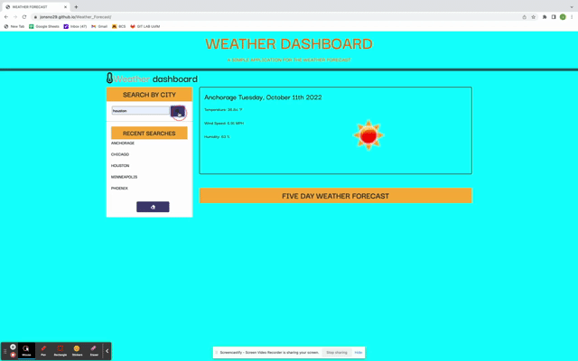

# Weather_Forecast

## OVERVIEW:

Using the OpenWeather API, I created a weather forecast that displays time, humidity, wind-speed and temperature.

The OpenWeather API, retrieves weather data, the local storage shows recent searches and more information about each 

city searched. Unfortunately for me, The five day forecast is not showing up. In the near future, I will start this 

project all over.

 ## User Story

AS A traveler

I WANT to see the weather outlook for multiple cities

SO THAT I can plan a trip accordingly

## Acceptance Criteria

GIVEN a weather dashboard with form inputs

WHEN I search for a city

THEN I am presented with current and future conditions for that city 

and that city is added to the search history

WHEN I view current weather conditions for that city

THEN I am presented with the city name, the date, an icon 

representation of weather conditions, the temperature, the humidity, 

and the wind speed WHEN I view future weather conditions for that city

THEN I am presented with a 5-day forecast that displays the date, an 

icon representation of weather conditions, the temperature, the wind 

speed, and the humidity WHEN I click on a city in the search history

THEN I am again presented with current and future conditions for that city.

## LIVE LINK:

Weather_Forecast Webpage: 

https://jonsno29.github.io/Weather_Forecast/

Weather_Forecast Repository: 

https://github.com/JonSno29/Weather_Forecast.git

## INSTALLATION, USAGE & MOCK-UP:

🎗 Terminal

🎗 Git

🎗 GitHub

🎗 GitHub Pages

🎗 Visual Studio (VS) Code 

🎗 HTML 

🎗 CSS 

🎗 Screencastify for mock-up GIF
 
🎗 javaScript

🎗 moment.js

🎗 API key

## CREDITS:

https://openweathermap.org/

The Instructors and fellow bootcampers at the U Of M, it's always fun collaborating with eachother.

# LICENSE:

MIT LICENSE

## FEATURES:

🎗 Uses a GIF to show features.

🎗 Acessable design.

🎗 Visually appealing.

🎗 Displays the date.

🎗 The API retrieves weather data.

🎗 Fetches temperature, wind-speed, humidity and displays rain or shine icons.

🎗 These features enhance user experience.

## HOW TO CONTRIBUTE:

Fork my repositories so I can fork yours:

Use the "scout rule" to help others.

## TESTS:

🎗 Trial and error

🎗 VScode to test my code

🎗 Research

## CONTACT:

Snoverjon@gmail.com